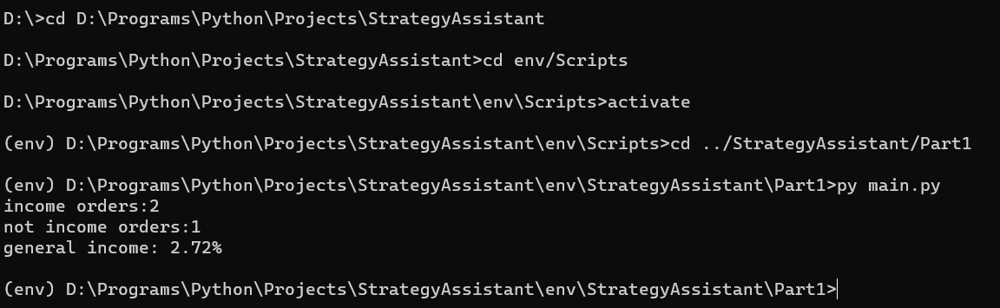
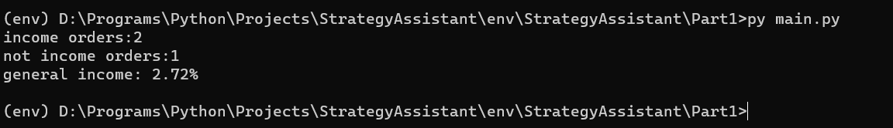
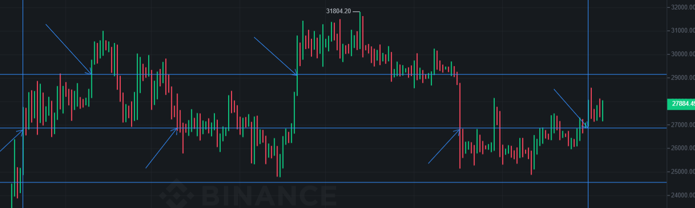

# Завдання 2 Частина 1

Контекст

1. [Запуск](#Запуск)
2. [Налаштування](#Налаштування)
3. [Порівнянн з ручним моделюванням](#Порівнянн-з-ручним-моделюванням)

# Запуск
Щоб запустити в себе вдома програму, необхідно склонувати даний репозиторій, потім через термінал запустити віртуальне середовище. Для цього треба знайти шлях до репозиторія і прописати в терміналі:
```
cd env/Scripts
activate
```
Коли віртуальне середовище з'явилось, лишилось перейти до програми і запустити її
```
cd ../StrategyAssistant/Part1
py main.py
```

Через певний час програма виведе результати:

1. кількість вдалих ордерів
2. кількість невдалих ордерів
3. загальний прибуток

# Налаштування
Програму можна налаштувати, змінивши певні налаштування.
Щоб написати певне налаштування, потрібно в команді `py main.py` в цьому ж рядку прописати --<аргумент> <значення>. Аргументів написати можна кілька.

Аргументи:
1. pair: яка саме криптовалюта буде використана. По замовчуванню BTC(BTCUSDT)
2. start: початок торгівлі. Писати як <день>-<місяць>-<рік>. По замовчуванню 19-03-2023.
2. end: кінець торгівлі. Писати як <день>-<місяць>-<рік>. По замовчуванню 01-10-2023.
3. interval: інтервал між цінами. По замовчуванню 1d. Можна ще писати 1h, 1m і так далі.
4. distance: відстань у відсотках між ордерами. По замовчуванню 0.085.
5. difference_capital_per_cent: різниця в капіталі між ордерами. По замовчуванню 0.02.

Приклад: 
```
py main.py --pair ETHUSDT --distance 0.02 --start 01-01-2023
```

# Порівнянн-з-ручним-моделюванням
Результат програми за замовчуванням. Проміжок часу: 19-03-2023 : 01-10-2023

Тепер ручне моделювання

Горисзонтальні лінії - лінії цін ордерів, найвижча для ордеру продажу на ціні 29180. Трохи нижча горизонтальна лінія - це ціна стартової точки 26900, нижче вже ціна 24600, якої так і не було досягнуто.
Вертикальні лінії вказують на початок та кінець історії. Стрілки допомагають зрозуміти де спрацьовували ордери, причому зверху вних стрілки - це ордери продажі і навпаки. Як видно, було лише 2 ордера продажі від початкової ціни. Також видно, що ордер купівлі початкої ціни спрацював і не встиг продати. Отже прибуток має вираховуватись так: (2 * відсток ордеру продажу + теперішня ціна / початкова ціна - 1 ) * частка капіталу = (2 * 0.085 + 26900 / 26900 -1) * 0.16 = 0.0272 = 2.72%. Враховуючи що ціни ми брали заокруглено, повна точність лякає.

[Завдання 2 Частина 2](https://github.com/DemaReaktor/StrategyAssistant/tree/main/env/StrategyAssistant/Part2)