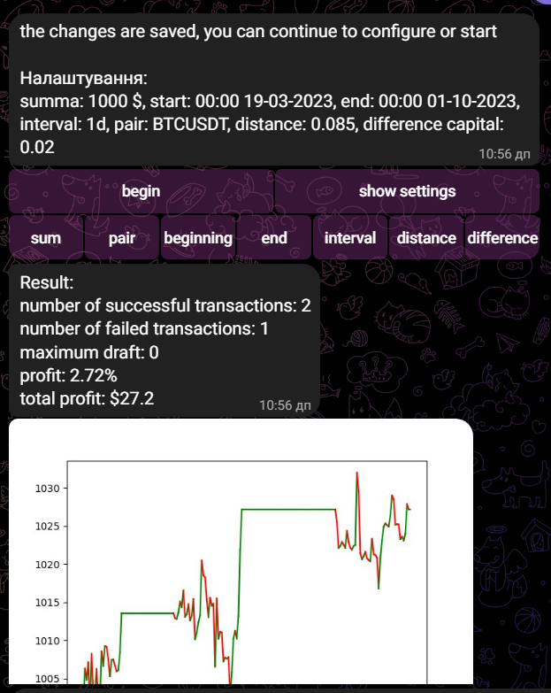
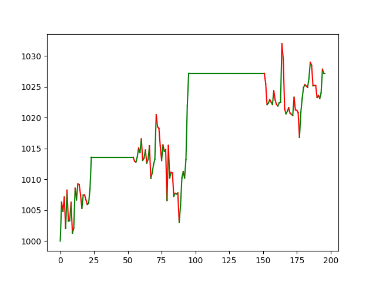

# Телеграм Бот
Бот в соціальній мережі телеграм, назва - StrategyAssistant, на даний момент не запущений. Використовує стратегію ["Піраміда"](https://github.com/DemaReaktor/StrategyAssistant/tree/main/%D0%A2%D0%B5%D0%BE%D1%80%D1%96%D1%8F%20%D0%B5%D1%84%D0%B5%D0%BA%D1%82%D0%B8%D0%B2%D0%BD%D0%BE%D1%97%20%D1%82%D0%BE%D1%80%D0%B3%D1%96%D0%B2%D0%BB%D1%96) щоб перевірити доцільність стратегії, використовує історичні дані цін вказаної криптовалюти.

# Контекст
1. [Шлях](#Шлях)
2. [Запуск](#Запуск)
3. [Налаштування](#Налаштування)
4. [Мови](#Мови)
5. [Бот](#Бот)

# Шлях
Телеграм бот має 4 команди: `/start, /change_language, /lelp, /strategy`. '/start' запускає бота, якщо спробуєте написати до нього без цього, він просто виведе попередження. '/change_language' змінює мову з української на англійську і навпаки. Більше написано в розділі [Мови](#Мови). '/help' дає повну інформацію про бота і стратегію, розділивши інформацію на пункти (що робить бот, суть стратегії, як налаштувати стратегію, які обмеження в стратегії). '/strategy' створює стратегію і дає меню, у якій можна змінювати налаштування, також можна побачити значення налаштування і головне - запустити стратегію.

# Запуск
Щоб запустити стратегію, потрібно:
1. нажати команду `/start`;
2. нажати команду `/strategy`;
3. за бажанням змінити певні значення налаштування стратегії(назва кнопки у меню команди `/strategy` відповідає змінній налаштування), також можна побачити налаштування, нажавши кнопку "показати налаштування". Детальніше про налаштування в розділі [Налаштування](#Налаштування).
4. нажати кнопку "почати".

При запуску стратегія певний час буде завантажуватись, потім виведе загальні результати і зображення де буде показано історію змін прибутку.

Приклад:

# Налаштування 
Стратегія має декілька зміних, яких можна міняти до запуску. Пара(pair) вказує, з якої саме криптовалюти буде братись ціни(BTCUSDT,ETHUSDT etc). Початок(start) - кінець(end) - проміжок часу, з якого братимуться ціни. Інтервал(interval) - інтервал між цінами, може приймати значення: 1m, 3m, 5m, 15m, 30m, 1h, 2h, 4h, 6h, 8h, 12h, 1d, 3d, 1w. Відстань(distance) - відстань між ордерами купівлі або продажі. Різниця(difference capital) - різниця між частинами капіталу.

Кожну змінну можна налаштувати у меню після команди `/strategy`. Для кожної змінної є спеціальна кнопка з її назвою.

Обмеження змінних:
1. початок має бути до кінця(це про час).
2. різниця і відстань мають бути більші 0, різниця має бути менша 0.25, а відстань 0.2.
3. Інтервал приймає лише спеціальні значення: 1m, 3m, 5m, 15m, 30m, 1h, 2h, 4h, 6h, 8h, 12h, 1d, 3d, 1w.

# Мови
Бот дозволяє змінювати мови з української на англійську і навпаки, але лише за умови, що вже була виконана раніше команда `/start`. Для цього достатньо виконати команду `/change_language`.
[!Warning] Частина тексту перекладена на англійську, решта автоматично перекладається за допомогою Google Translator.

# Бот
Щоб запустити цей бот у себе, потрібно склонувати даний репозиторій, далі завантажити необхідні бібліотеки(див. requirements.txt). Далі у файлі env/StrategyAssistant/Part2/Config.py замінити "token" на токен, який видасть батько ботів. По завершенню можна запустити програму у файлі env/StrategyAssistant/Part2/main.py. 
