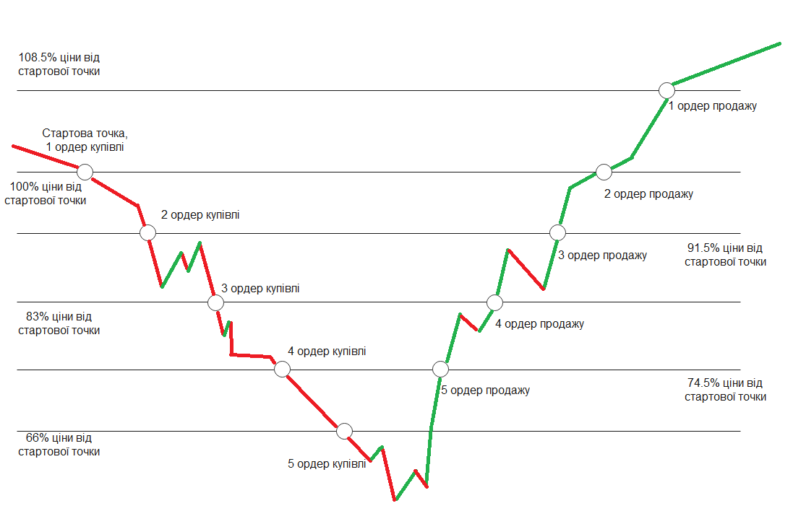
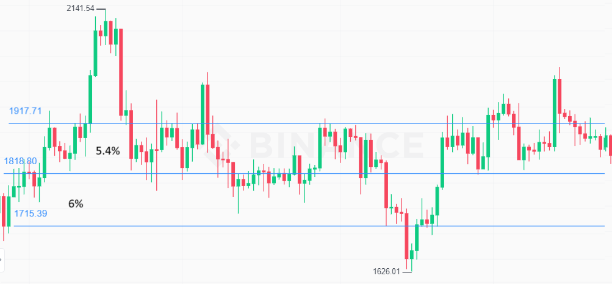

# Теорія ефективної торгівлі
Контекст

[Алгоритм входу](#Алгоритм-входу)

[Алгоритм виходу](#Алгоритм-виходу)

[Схема](#Схема)

[Приклад](#Приклад)

[Пояснення логіки і чисел](#Пояснення-логіки-і-чисел)

[Результат](#Результат)

# Алгоритм-входу
1. Поділити капітал на 5 частин: 16% , 18% , 20%, 22% і 24% від загальної суми.
2. Виставити ордери на відстані 8.5% від кожного попереднього.
3. При спрацювані ордерів продажі, повторно виставляти ордери купівлі на попередніх місцях за рахунок капаталу спрацьованих ордерів продажі.(чистий прибуток залишити) 

# Алгоритм-виходу 
1. Створити ордер продажу на 8.5% вище за ціну, на якій ордер купівлі спрацював. 

# Схема

прибуток складатиме 8.5% від залученого капіталу при умові, що всі виставлені ордери продажу спрацюють, тобто ціна в кінці виросте до 108.5% від початкової. 

Стратегія розрахована на зниження ціни до 34%. Через те, що більша частина капіталу знаходиться ближче до ціни 66%, максимальна просадка капіталу досягає 22,3%, коли наближається до ціни 66% від початкової, не зачепивши останій ордер куппівлі.

Стратегія не обов'язково повина мати 8.5% відстані між ордерами.
Нехай x - відстань у відсотках між ордерами купівлі. Тоді відстань між ордерами продажі теж x, максимальне зниження ціни для ордерів складає 4x, відстань між ордерами продажі теж складає x. Прибуток складає 100%+x від залученого капіталу при спрацюванні всіх виставлених ордерів продажу.

Також варто зазначити, що якщо після кількох спрацювань ордерів купівлі потім спрацювали кілька ордерів продажі, не обов'язково чекати поки всі ордери продажі спрацюють, можна відразу відновлювати ордери купівлі на капіталі спрацьованих ордерів продажі, чистий дохід при цьому залишити.

# Приклад
якщо ціна опустилась на 17%, тобто були зроблені 3 ордери, то за стратегією виходу має створитись 3 ордери продажу: 91.5%, 100% і 108.5% від точки входу, причому отримані актвиви від ордеру купівлі на точці входу мають продатись на ордері продажу з ціною 108.5% від точки входу, і так далі.

Розглянемо приклад із заниженою відстаню.

В даному випадку використовувати відстані в 8.5% недоречно, оскільки ордери дуже рідко спрацьовують. При зменшені відстаней до 1.5% завдяки волотильності в 5% по обидва боки, ордери доволі часто спрацьовуватимуть, як продажі так і купівлі. 

# Пояснення-логіки-і-чисел
Основна логіка стратегії полягає в тому, що зі зниженням ціни долучається більша частина капіталу, що применшує втрати від попередніх ордерів. Навіть якщо після кількох спрацювань ордерів купівлі спрацює один ордер продажі, він через більший капітал сильно применшує втрати. Проте мінусом є використання не всього капіталу, якщо ціна не сильно падатиме, що зменшить прибуток як наслідок.

Останій ордер має в 1.5 рази більше капіталу, ніж перший, остальні рівновідалені між собою і цими 2 ордерами.
Нехай x - частка капіталу першого ордера.
x+1.125x+1.25x+1.375x+1.5x=1; x=1/6.25=4/25;
Вирахувавши, 1 ордер має 16%, 2 ордер - 18%, 3 - 20%, 4 - 22%, 5 - 24% 

Різницю в частках капіталу ордерів теж можна змінювати , наприклад: 12%,16%,20%,24% і 28%. Збільшення різниці призведе до зменшення прибутку при низькій волотильності(коли не всі ордери купівлі будуть спрацьовувати), а також до зменшення втрат при високій волотильності.

# Результат
Дана стратегія підходить для середньоризикових активів, які мають достатню волотильність і водночас мають невисокий шанс обвалу. 

Для 2 завдання дану стратегію будем називати "Піраміда"(чим нижче йде ціна, тим більше капіталу зустріне). 